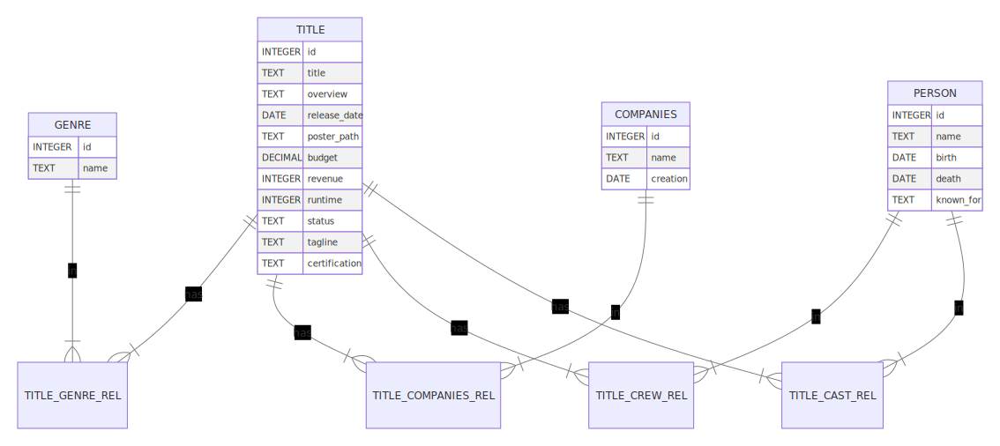

# Design Document

By Rafael de Andrade

Nick Movie Database

Video overview: https://youtu.be/xCV-W08py0I

## Scope 

#### Purpose

The purpose of this database is to manage information related to movies, including details about titles, genres, production companies, cast and crew members, and other relevant data points. It serves as a comprehensive repository for organizing and querying movie-related information.

#### Included Entities

- **Title**: Represents individual movies, including attributes such as title, overview, release date, runtime, budget, revenue, status, tagline, and certification.

- **Genre**: Represents different genres that movies can belong to.

- **Person**: Represents individuals involved in the movie industry, such as actors, directors, writers, etc., with attributes including name, birthdate, death date, and known works.

- **Companies**: Represents production companies involved in movie production, with attributes including name and creation date.

- **Crew**: Represents individuals involved in various roles behind the scenes of a movie, such as directors, writers, editors, etc., with attributes including role.

- **Cast**: Represents individuals who appear in front of the camera, such as actors, with attributes including role.

#### Excluded Entities

- **User Accounts**: There is no rating whatsoever from any site like IMDB or TMDB.
- **Awards info**: no awards info either.
- **Movie Reviews**: While the database includes information about movies themselves, it does not include entities related to user-generated reviews or ratings.

## Functional Requirements

A user should be able to:

- Retrieve information about movies, including titles, release dates, genres, cast and crew members, and other relevant details.
- Perform searches and filter data based on various criteria, such as movie titles, release dates, genres, and cast/crew members.
- Add new movies, genres, production companies, cast/crew members, and other related entities to the database.
- Update existing records to reflect changes, such as editing movie details, adding/removing cast/crew members, or updating genre information.
- Delete records that are no longer needed or are erroneous, ensuring the database remains accurate and up-to-date.

Beyond the scope of the database, users should not be able to:

- Submit or view user-generated movie reviews, ratings, or other forms of user-generated content that are not directly related to the management of movie data.
## Representation

#### Entities

- **Title**:
    
    - title (TEXT): The title of the movie.
    - overview (TEXT): A brief description of the movie.
    - release_date (DATE): The release date of the movie.
    - poster_path (TEXT): The path to the movie's poster image.
    - budget (DECIMAL(10, 2)): The budget of the movie.
    - revenue (INTEGER): The revenue generated by the movie.
    - runtime (INTEGER): The runtime of the movie in minutes.
    - status (TEXT): The status of the movie (e.g., released, in production).
    - tagline (TEXT): A tagline associated with the movie.
    - certification (TEXT): The certification of the movie (e.g., PG-13, R).
- **Genre**:
    
    - name (TEXT): The name of the genre.
- **Person**:
    
    - name (TEXT): The name of the person.
    - birth (DATE): The birthdate of the person.
    - death (DATE): The death date of the person (if applicable).
    - known_for (TEXT): Notable works or roles associated with the person.
- **Companies**:
    
    - name (TEXT): The name of the production company.
    - creation (DATE): The date of establishment of the company.
- **Crew**:
    
    - person_id (INTEGER): The ID of the person.
    - role (TEXT): The role of the crew member in the movie.
- **Cast**:
    
    - person_id (INTEGER): The ID of the person.
    - role (TEXT): The role of the cast member in the movie.

#### Data Types and Constraints

- **Data Types**: The chosen data types reflect the nature of the attributes. For example, TEXT for string data, DATE for date values, DECIMAL for monetary values, and INTEGER for numeric values such as runtime and revenue.
    
- **Constraints**: Constraints such as NOT NULL ensure that essential information is always provided. Primary keys ensure each record's uniqueness, while foreign key constraints maintain referential integrity between related tables.
    

### Relationships

## Optimizations

To optimize performance and enhance query capabilities, the following optimizations were implemented:

- **Indexes**: Indexes were created on commonly queried columns, such as "title" for titles, "name" for genres, companies, and people, and foreign key columns used in many-to-many relationship tables. These indexes facilitate faster retrieval of data and improve query performance.
    
- **Views**: A view named "title_summary" was created to provide a summary view of movie titles, including attributes such as title, overview, release date, and runtime. Views offer a convenient way to query and retrieve specific subsets of data without repeatedly specifying the same criteria in queries.

## Limitations

- **Complex Relationships**: The database design may struggle to represent complex relationships between entities, such as intricate hierarchical structures within production companies or detailed historical data about individuals' careers.
    
- **Data Volume**: As the database grows in size with a vast number of titles, people, and companies, performance may degrade, and additional optimizations or scaling may be necessary to maintain responsiveness.